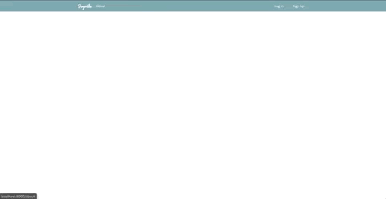

# Joyride

Joyride is a long-distance community-based rideshare application built with React on the front-end and Python on the back-end. 
Users have a profile page where they can upload an image, description, and location, and check notifications as well as recent 
feedback from rides and drives. Users can search or post a ride with the aid of Google autocomplete, or use the chat feature to
message the driver. Drivers will get a text message notification when someone requests their ride through the Twilio API. They 
can navigate to their rides page where they can check, edit, or delete current drives and rides and approve rider requests. The 
rides page also shows the driver/rider's contact info and links to their profile. Users can rate their ride in the past ride section.

**Techstack: Javascript, React, Bootstrap, CSS, Python,  Flask, SQLAlchemy , socketio\
APIS: Google Maps/Place, Twilio**

## Homepage

## About Me

## Profile/Dashboard

## Post

## Search

## Messaging

## Current Drives/Rides

## Past Drives/Rides